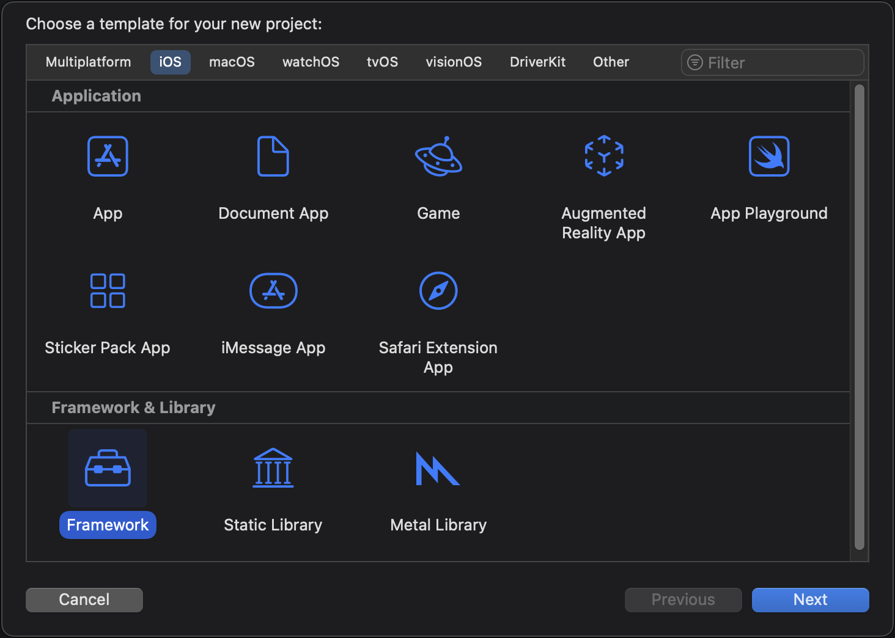
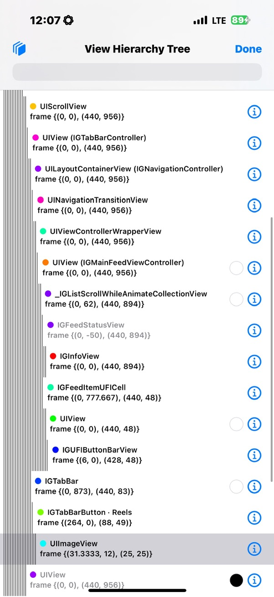

### The itch

It started, as these things often do, with procrastination disguised as productivity.  
I opened Instagram *“just to DM my lab partner”* and—thirty swipes later—realised I was watching a stranger do parkour on a roof in Warsaw. The Reels tab had hijacked me again. Deleting the app was the obvious move, but I still needed Stories for group projects and DMs for club logistics. So the question became:

> **Can I carve Reels out of Instagram while keeping everything else?**

I gave myself the evening to find out.

---

## Stage 1 · Static scouting (IDA Pro & caffeine)

The first breadcrumb was to grab an **unencrypted** build of the app (there are mirrors if you search). I opened the Mach-O in **IDA Pro**, searched for selector strings, and quickly spotted:

```
IGTabBarButton
IGModernFeedVideoCell
IGFeedPlayableClipCell
IGExploreGridViewController
```

Bingo: a map of every surface where short-form video might lurk.

Without a jailbreak, static analysis is all we get, but even that reveals the skeleton:

```
IGMainTabBarController
  └─ IGTabBar
       ├─ IGTabBarButton (Home)
       ├─ IGTabBarButton (Search)
       ├─ IGTabBarButton (Reels)   ← target
       └─ IGTabBarButton (Profile)
```

---

## Stage 2 · Bringing FLEX to the party

Static clues are helpful; runtime inspection is decisive.  
I compiled **FLEX** into a standalone dylib, injected it, shook the phone, and—boom—live class list, memory browser, and a full hierarchy viewer.



Scrolling the tree confirmed suspicions: an `IGTabBarButton` labelled “Reels,” feed cells called `IGModernFeedVideoCell`, and carousels with `IGFeedPlayableClipCell`. A screenshot of the culprit button:



That single tab was the front door to my wasted time.

---

## Stage 3 · Designing the attack

I sketched a minimal spec:

| Goal | Technique |
|------|-----------|
| Remove the Reels nav icon | iterate through subviews, blank the button |
| Stop autoplay clips in Home feed | hide `IGModernFeedVideoCell` |
| Kill the “Suggested Reels” carousel | hide any `UICollectionView` that owns an `IGFeedPlayableClipCell` |
| Blank Explore grid | swizzle `IGExploreGridViewController viewDidLoad` |

Instead of hooking half the view lifecycle, I opted for a **0.5-second polling loop**. It’s crude but future-proof: if Meta renames a controller tomorrow, the traversal still finds it, logs a miss, and I can update a single string.

---

## Stage 4 · Writing `NoReels.m`

Below is the full source, chunked with commentary after each block so you can follow the reasoning—not just copy-paste.

```swift
#import "NoReels.h"
#import <objc/runtime.h>
#import <objc/message.h>
#import <FLEX.h>
#import <UIKit/UIKit.h>

// -------------------------------------------------------------
//  Singleton scaffold + load-time bootstrap
// -------------------------------------------------------------

@interface NoReels () @property (nonatomic, strong) NSTimer *timer; @end

@implementation NoReels

+ (void)load {
    NSLog(@"[NoReels] dylib loaded into Instagram");
    dispatch_async(dispatch_get_main_queue(), ^{
        [[self sharedInstance] startTimer];
    });
}

+ (instancetype)sharedInstance {
    static NoReels *shared;
    static dispatch_once_t once;
    dispatch_once(&once, ^{ shared = [self new]; });
    return shared;
}
```

The `+load` method is our entry point—guaranteed to run the moment the Framework is mapped. We hop to the main queue, start a repeating timer, and let UIKit settle.

---

```swift
// -------------------------------------------------------------
//  Timer kicks off a depth-first traversal of the UI tree
// -------------------------------------------------------------
- (void)startTimer {
    [self.timer invalidate];
    self.timer = [NSTimer scheduledTimerWithTimeInterval:0.5
                                                  target:self
                                                selector:@selector(scanViews)
                                                userInfo:nil
                                                 repeats:YES];
}

- (void)scanViews {
    UIWindow *root = UIApplication.sharedApplication.keyWindow;
    if (root) [self processView:root];
}
```

A traversal loop costs a few microseconds every half-second, a fair trade for robustness across app updates.

---

```swift
// -------------------------------------------------------------
//  Core logic: find & neutralise attention traps
// -------------------------------------------------------------
- (void)processView:(UIView *)view {
    for (UIView *sub in view.subviews) {

        // 1️⃣  Strip the "Reels" tab.
        if ([sub isKindOfClass:NSClassFromString(@"IGTabBarButton")] &&
            ([sub.description containsString:@"Reels"] ||
             [sub.accessibilityLabel containsString:@"Reels"])) {

            UIButton *btn = (UIButton *)sub;
            [btn setTitle:@"" forState:UIControlStateNormal];
            [btn setImage:nil forState:UIControlStateNormal];
            btn.enabled = btn.userInteractionEnabled = NO;
        }

        // 2️⃣  Hide autoplay clips in main feed.
        if ([sub isKindOfClass:NSClassFromString(@"IGModernFeedVideoCell.IGModernFeedVideoCell")] &&
            ![sub.superview isKindOfClass:NSClassFromString(@"IGCarouselCollectionView")]) {
            sub.hidden = YES;
        }

        // 3️⃣  Hide "Suggested Reels" carousels.
        if ([sub isKindOfClass:[UICollectionView class]]) {
            for (UIView *cell in sub.subviews) {
                if ([cell isKindOfClass:NSClassFromString(@"IGFeedPlayableClipCell")]) {
                    sub.hidden = YES;
                    break;
                }
            }
        }

        [self processView:sub]; // recurse
    }
}
```

The three `if` blocks correspond exactly to the spec. Any future class rename triggers a log entry in Console, making fixes trivial.

---

```swift
// -------------------------------------------------------------
//  Auxiliary: NSFileManager sanity check
// -------------------------------------------------------------
@implementation NSFileManager (NoReels)
+ (void)load {
    Method o = class_getInstanceMethod(self,
        @selector(enumeratorAtURL:includingPropertiesForKeys:options:errorHandler:));
    Method n = class_getInstanceMethod(self,
        @selector(nr_enum:includingPropertiesForKeys:options:errorHandler:));
    method_exchangeImplementations(o, n);
}
- (NSDirectoryEnumerator<NSURL *> *)nr_enum:(NSURL *)url
               includingPropertiesForKeys:(NSArray<NSURLResourceKey> *)keys
                                  options:(NSDirectoryEnumerationOptions)mask
                             errorHandler:(BOOL (^)(NSURL *, NSError *))handler {
    if (!url) { NSLog(@"[NoReels] nil URL passed to enumerator"); return nil; }
    return [self nr_enum:url includingPropertiesForKeys:keys options:mask errorHandler:handler];
}
@end
```

Not strictly required, but a neat example of how to inject guard-rails into system calls.

---

```swift
// -------------------------------------------------------------
//  Blank the Explore grid; it's just Reels in disguise.
// -------------------------------------------------------------
@implementation UIViewController (NoExplore)
+ (void)load {
    Class grid = NSClassFromString(@"IGExploreGridViewController");
    Method o   = class_getInstanceMethod(grid, @selector(viewDidLoad));
    Method n   = class_getInstanceMethod(self,  @selector(nr_viewDidLoad));
    method_exchangeImplementations(o, n);
}
- (void)nr_viewDidLoad {
    [self nr_viewDidLoad];
    if ([self isKindOfClass:NSClassFromString(@"IGExploreGridViewController")]) {
        UIView *blank = [[UIView alloc] initWithFrame:self.view.bounds];
        blank.backgroundColor = UIColor.whiteColor;
        self.view = blank;
    }
}
@end
```

Explore had to go: Meta’s ML pipeline populates it with the same short-form bait, just under a different icon.

---

## Stage 5 · Turning code into a Framework

Xcode handles most of the boilerplate. The only gotcha: set **Mach-O Type** to “Dynamic Library.” Archive for arm64, grab `NoReels.framework` from the Release-iphoneos directory, and you’re ready for injection.


---

## Stage 6 · Sideloadly to the rescue

Sideloadly is AltStore’s pragmatic cousin: drag in the stock Instagram `.ipa`, click **+ Tweaks** and drop the Framework, sign with any Apple-ID certificate (free accounts = 7-day expiry), install, trust the newly signed bundle under *Settings → General → Device Management*, and launch.

Console shows:

```
[NoReels] dylib loaded into Instagram
```

Seconds later the Reels icon flickers, disappears, and autoplay cells vanish from the main feed. Stories still open, DMs still send; the slot-machine is gone.

---

## Why Meta will never offer a proper toggle

The conflict is structural. Reels drives *watch time*; watch time drives *ad inventory*; ad inventory drives quarterly revenue. A “Hide Reels” setting would crater a key performance metric—no PM survives that pitch meeting. Instead Meta publishes wellness blog posts advising you to “set screen-time reminders,” offloading responsibility back onto the user while the design remains optimised to defeat that very self-control.

Rewriting the binary is faster than lobbying a trillion-dollar ad network for mercy.

---

## In closing

A Framework, a polling loop, and a few `isKindOfClass:` checks—nothing here is rocket science, yet the payoff is profound: cognitive quiet where there was once engineered noise. Copy the code, tweak the class names after each IG update, and spend your reclaimed attention on something Instagram can’t monetise—like actually finishing that lab report. Feel free to grab the whole codebase from [GitHub](https://github.com/domilx/NoReelsInstagram).